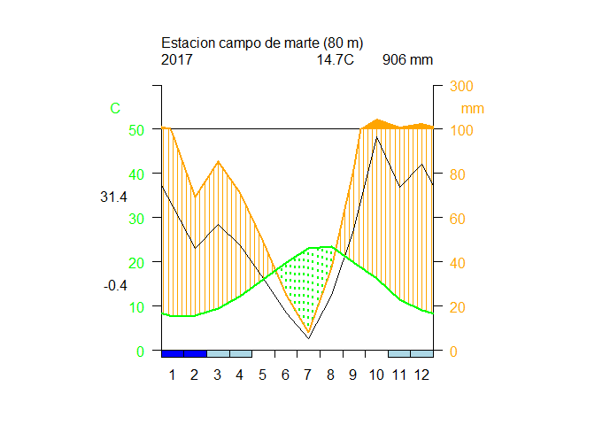
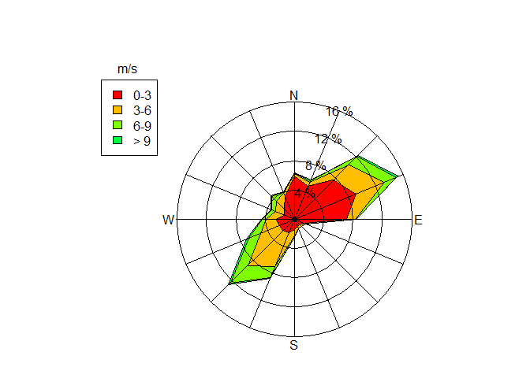

Climatol_tarea
================
Silva C.,Angela Ximena
28/1/2022

# TAREA ADICIONAL

``` r
library(climatol)
```

    ## Warning: package 'climatol' was built under R version 4.1.2

    ## Loading required package: maps

    ## Warning: package 'maps' was built under R version 4.1.2

    ## Loading required package: mapdata

    ## Warning: package 'mapdata' was built under R version 4.1.2

# NIVEL 1

## 1. Generar un diagrama de Walter y Lieth con la data de datcli, este debe llevar de título “Estación Campo de Marte”, a una altitud de 80 msnm durante el año 2017, con los meses simbolizados por números. Las temperaturas deberán visualizarse de color verde; las precipitaciones, en naranja; los meses de congelación segura, en azul y los de congelación probable, en celeste. No trazar una línea suplementaria de precipitación.

``` r
data(datcli) 
diagwl(datcli, "Estacion campo de marte", 80, "2017", mlab="xd", pcol = "orange", tcol = "green", pfcol="lightblue", sfcol = "blue", shem=FALSE, p3line = T)
```

<!-- -->

## 2. Recrea minuciosamente el siguiente diagrama de la rosa de los vientos (pista: col=rainbow(8)).

``` r
data(windfr)
rosavent(windfr,fnum=4,fint=4,flab=2,ang=3*pi/8,col=rainbow(8),uni="m/s")
```

<!-- -->

# NIVEL 2

## 3. Convertir la data diaria de tmax en una data de medias mensuales. Posteriormente, homogeneizar dichos datos mensuales con una normalización por estandarización y gráficos de medias anuales y correcciones aplicadas en el análisis exploratorio de datos (utilizar dos decimales).

``` r
data(tmax)

# Exportamos archivos del database de R a nuestro equipo:
#write.table(dat,"Tmax_2001-2003.dat", row.names=F, col.names=F)
#write.table(est.c, "Tmax_2001-2003.est", row.names=F, col.names=F)

#homogen('Tmax',2001,2003,nm=0, std=2,ndec=3,gp=3,expl=TRUE)
```

## 4. Recortar la data mensual de Ptest desde 1965 hasta 2005. Homogeneizar dicha data mediante clústers o áreas rectangulares, con un ancho de superposición de 0, mediante una estandarización y con gráficos de totales anuales en el análisis exploratorio de datos. Mostrar las medias de las series homogeneizadas en un archivo Excel que, además, mencione los totales anuales y los datos de la latitud, longitud y nombre de cada estación (utilizar dos decimales).

``` r
data(Ptest)

#recortar la data desde 1965 - 2005:
#write.table(dat,'Ptest_1951-2010.dat',row.names=F,col.names=F)
#write.table(est.c,'Ptest_1951-2010.est',row.names=F,col.names=F)
#datsubset('Ptest', 1951, 2010, 1965, 2005, 1)
#read.table("Ptest_1965-2005.dat")

#homogenizamos por clusters o areas rectangulares
dim(dat)<-c(720, 20)
write(dat[1:720,1:20],'Ptest_1965-2005.dat')
write.table(est.c[1:12,1:5],'Ptest_1965-2005.est',row.names=FALSE,col.names=FALSE)
homogsplit('Ptest', 1965, 2005, 0,0,std=3, nm=0, ndec=2, gp=4)
```

    ## 
    ## HOMOGSPLIT() APPLICATION OUTPUT  (From R's contributed package 'climatol' 3.1.1)
    ## 
    ## =========== Homogenization of Ptest, 1965-2005. (Fri Jan 28 19:47:27 2022)
    ## 
    ## Parameters: varcli=Ptest anyi=1965 anyf=2005 xc=0 yc=0 xo=0.5 yo=0.38 maponly=FALSE suf=NA nm=0 nref=10,10,4 swa=NA std=3 ndec=2 dz.max=5 dz.min=-5 wd=0,0,100 snht1=25 snht2=25 tol=0.02 maxdif=NA mxdif=NA force=FALSE wz=0.001 trf=0 mndat=NA gp=4 ini=NA na.strings=NA maxite=999 vmin=NA vmax=NA nclust=100 grdcol=#666666 mapcol=#666666 hires=TRUE expl=FALSE metad=FALSE sufbrk=m tinc=NA tz=UTC cex=1.2 verb=TRUE x=NA
    ## 
    ## 
    ## ==================================================
    ## 
    ##               AREA  1 1 
    ## 
    ## ==================================================
    ## 
    ## No target stations in this area
    ## 
    ## ==================================================
    ## 
    ##               AREA  1 2 
    ## 
    ## ==================================================
    ## 
    ## No target stations in this area
    ## 
    ## ==================================================
    ## 
    ##               AREA  2 1 
    ## 
    ## ==================================================
    ## 
    ## No target stations in this area
    ## 
    ## ==================================================
    ## 
    ##               AREA  2 2 
    ## 
    ## ==================================================
    ## 
    ## 
    ## HOMOGEN() APPLICATION OUTPUT  (From R's contributed package 'climatol' 3.1.1)
    ## 
    ## =========== Homogenization of Ptest-1, 1965-2005. (Fri Jan 28 19:47:27 2022)
    ## 
    ## Parameters: varcli=Ptest-1 anyi=1965 anyf=2005 suf=NA nm=0 nref=10,10,4 std=3 swa=NA ndec=2 dz.max=5 dz.min=-5 wd=0,0,100 snht1=25 snht2=25 tol=0.02 maxdif=0.005 mxdif=0.005 maxite=999 force=FALSE wz=0.001 trf=0 mndat=NA gp=4 ini=NA na.strings=NA vmin=NA vmax=NA nclust=100 cutlev=NA grdcol=#666666 mapcol=#666666 hires=TRUE expl=FALSE metad=FALSE sufbrk=m tinc=NA tz=UTC cex=1.2 verb=TRUE
    ## 
    ## Data matrix: 1200 data x 12 stations

    ## 
    ## -------------------------------------------
    ## Stations in the 3 clusters:
    ## 
    ## $`1`
    ##      Z Code        Name
    ## 1  183 S031 Station_031
    ## 4  129 S051 Station_051
    ## 7  865 S058 Station_058
    ## 10 107 S034 Station_034
    ## 
    ## $`2`
    ##      Z Code        Name
    ## 2  125 S047 Station_047
    ## 5   79 S081 Station_081
    ## 8    1 S095 Station_095
    ## 11   6 S088 Station_088
    ## 
    ## $`3`
    ##      Z Code        Name
    ## 3  100 S098 Station_098
    ## 6   64 S069 Station_069
    ## 9   38 S039 Station_039
    ## 12 160 S055 Station_055
    ## 
    ## ---------------------------------------------

    ## Computing inter-station distances:  1  2  3  4  5  6  7  8  9  10  11
    ## 
    ## 
    ## ========== STAGE 1 (SNHT on overlapping temporal windows) ===========

    ## There are stations with less than 182.5 data:
    ## Stations :   11 
    ## N of data:  140 
    ## These stations will be deleted in order to proceed:
    ## S088(11) Station_088  DELETED
    ## 
    ## Computation of missing data with outlier removal
    ## (Suggested data replacements are provisional)
    ##   Station(rank) Date: Observed -> Suggested (Anomaly, in std. devs.)
    ## S031(1) 1967-02-05: 553.9 -> 190.21 (6.48)
    ## S047(2) 1965-10-13: 696.9 -> 88.33 (9.56)
    ## S047(2) 1966-05-17: 603.3 -> 185 (6.57)
    ## S098(3) 1966-06-10: 670.5 -> 120.08 (10.01)
    ## S098(3) 1966-08-21: 361.8 -> 78.62 (5.15)
    ## S051(4) 1967-01-02: 759.1 -> 105.21 (5.5)
    ## S051(4) 1967-03-03: 1402.3 -> 215.18 (9.99)
    ## S051(4) 1967-04-07: 958.3 -> 239.99 (6.04)
    ## S051(4) 1967-05-03: 818.8 -> 108.48 (5.97)
    ## S051(4) 1967-07-25: 860.5 -> 249.95 (5.13)
    ## S051(4) 1967-09-09: 1019.8 -> 386.41 (5.32)
    ## S081(5) 1965-01-15: 780.1 -> 62.19 (6.88)
    ## S081(5) 1965-02-06: 609.1 -> 30.13 (5.55)
    ## S081(5) 1965-03-02: 752.2 -> 84.48 (6.4)
    ## S081(5) 1965-05-12: 718.4 -> 114.27 (5.79)
    ## S081(5) 1965-05-22: 811.4 -> 233.3 (5.54)
    ## S081(5) 1965-05-27: 673.9 -> 96.06 (5.54)
    ## S069(6) 1966-01-17: 304.5 -> 76 (5.1)
    ## S058(7) 1967-12-26: 630 -> 175.13 (7.12)
    ## S095(8) 1966-09-02: 428.5 -> 154.16 (5.29)
    ## S039(9) 1968-01-07: 667.1 -> 220.24 (8.41)
    ## S039(9) 1968-03-19: 343.8 -> 64.82 (5.27)
    ## S034(10) 1965-06-02: 310.5 -> 26.67 (6.02)
    ## S055(12) 1965-05-11: 428.7 -> 63.35 (6.49)
    ## 
    ## Performing shift analysis on the 12 series...
    ## 
    ## S081(5) breaks at 1965-08-29 (164.7)

    ## 
    ## 
    ## Update number of series:  12 + 1 = 13 
    ## 
    ## Computation of missing data with outlier removal
    ## (Suggested data replacements are provisional)
    ##   Station(rank) Date: Observed -> Suggested (Anomaly, in std. devs.)
    ## S031(1) 1967-03-03: 353.7 -> 41.36 (5.57)
    ## S051(4) 1967-02-05: 818.9 -> 232.18 (5.67)
    ## S051(4) 1967-05-27: 625.6 -> 78.84 (5.29)
    ## S081(5) 1965-10-13: 334.4 -> 53.63 (6.14)
    ## S081(5) 1967-10-02: 300.3 -> 18.4 (6.17)
    ## S081(5) 1967-10-03: 377.3 -> 142.55 (5.15)
    ## S069(6) 1965-03-23: 303.7 -> 86.12 (5.04)
    ## S039(9) 1967-12-02: 370.7 -> 97.52 (6.31)
    ## S039(9) 1967-12-14: 366.6 -> 101.57 (6.13)
    ## S039(9) 1968-03-07: 323.4 -> 87.8 (5.46)
    ## S055(12) 1965-09-12: 368 -> 95.86 (5.05)
    ## 
    ## Performing shift analysis on the 13 series...
    ## 
    ## S051(4) breaks at 1966-12-23 (107.9)

    ## 
    ## 
    ## Update number of series:  13 + 1 = 14 
    ## 
    ## Computation of missing data with outlier removal
    ## (Suggested data replacements are provisional)
    ##   Station(rank) Date: Observed -> Suggested (Anomaly, in std. devs.)
    ## S081(5) 1965-10-12: 243.2 -> 21.11 (5.36)
    ## S051-2(14) 1965-02-15: 472.2 -> 115.74 (6.87)
    ## S051-2(14) 1965-04-17: 442.4 -> 134.1 (5.95)
    ## 
    ## Performing shift analysis on the 14 series...
    ## 
    ## S047(2) breaks at 1967-08-15 (27.0)

    ## 
    ## 
    ## Update number of series:  14 + 1 = 15 
    ## 
    ## Computation of missing data with outlier removal
    ## (Suggested data replacements are provisional)
    ##   Station(rank) Date: Observed -> Suggested (Anomaly, in std. devs.)
    ## S031(1) 1965-04-17: 389.4 -> 87.64 (5.54)
    ## S047(2) 1967-10-03: 359 -> 97.8 (5.31)
    ## 
    ## Performing shift analysis on the 15 series...

    ## 
    ## 
    ## ========== STAGE 2 (SNHT on the whole series) =======================

    ## Computation of missing data with outlier removal
    ## (Suggested data replacements are provisional)
    ##   Station(rank) Date: Observed -> Suggested (Anomaly, in std. devs.)
    ## (No detected outliers)
    ## 
    ## Performing shift analysis on the 15 series...

    ## 
    ## 
    ## ========== STAGE 3 (Final computation of all missing data) ==========
    ## 
    ## Computing inter-station weights... (done)

    ## Computation of missing data with outlier removal
    ## (Suggested data replacements are provisional)
    ## 
    ## The following lines will have one of these formats:
    ##   Station(rank) Date: Observed -> Suggested (Anomaly, in std. devs.)
    ##   Iteration Max.data.difference (Station_code)
    ## S081(5) 1967-12-15: 239 -> 33.62 (5.17)
    ## S034(10) 1968-02-10: 273.7 -> 39.26 (5.5)
    ## 2 -122.7101 (S081-2)
    ## 3 6.2929 (S081-2)
    ## 4 3.9884 (S081-2)
    ## 5 2.4576 (S081-2)
    ## 6 1.4732 (S081-2)
    ## 7 0.8685 (S081-2)
    ## 8 0.5058 (S081-2)
    ## 9 0.2914 (S081-2)
    ## 10 0.1659 (S081-2)
    ## 11 0.0929 (S081-2)
    ## 12 0.0519 (S095)
    ## 13 0.036 (S095)
    ## 14 0.0254 (S095)
    ## 15 0.0183 (S095)
    ## 16 0.0134 (S095)
    ## 17 0.0099 (S095)
    ## 18 0.0073 (S095)
    ## 19 0.0055 (S095)
    ## 20 -0.0042 (S081-2)
    ## 
    ## Last series readjustment (please, be patient...)

    ## 
    ## ======== End of the homogenization process, after 19.78 secs 
    ## 
    ## ----------- Final computations:
    ## 
    ## ACmx: Station maximum absolute autocorrelations of anomalies
    ##    Min. 1st Qu.  Median    Mean 3rd Qu.    Max.    NA's 
    ##  0.0900  0.1125  0.1300  0.1600  0.1725  0.3500       1 
    ## 
    ## SNHT: Standard normal homogeneity test (on anomaly series)
    ##    Min. 1st Qu.  Median    Mean 3rd Qu.    Max.    NA's 
    ##   2.600   4.250   6.000   7.571  11.150  16.500       1 
    ## 
    ## RMSE: Root mean squared error of the estimated data
    ##    Min. 1st Qu.  Median    Mean 3rd Qu.    Max.    NA's 
    ##   37.95   40.28   51.74   60.37   61.82  125.89       2 
    ## 
    ## POD: Percentage of original data
    ##    Min. 1st Qu.  Median    Mean 3rd Qu.    Max. 
    ##    11.0    23.5    38.0    46.6    70.5    91.0 
    ## 
    ##    ACmx SNHT RMSE  POD Code   Name         
    ## 1  0.12 16.5  51.0 91  S031   Station_031  
    ## 2  0.35  4.4  39.7 19  S047   Station_047  
    ## 3  0.14 11.4  54.8 89  S098   Station_098  
    ## 4  0.10  3.1 125.9 38  S051   Station_051  
    ## 5  0.10  4.2  38.8 64  S081   Station_081  
    ## 6  0.15 11.0  48.9 81  S069   Station_069  
    ## 7  0.29  5.7  51.7 23  S058   Station_058  
    ## 8  0.18 12.8  61.8 35  S095   Station_095  
    ## 9  0.12 11.2  37.9 28  S039   Station_039  
    ## 10 0.11  2.8  40.3 24  S034   Station_034  
    ## 11   NA   NA    NA 11  S088   Station_088  
    ## 12 0.15  6.2 115.8 42  S055   Station_055  
    ## 13 0.22  5.8  61.9 19  S081-2 Station_081-2
    ## 14 0.09  2.6  56.2 58  S051-2 Station_051-2
    ## 15 0.12  8.3    NA 77  S047-2 Station_047-2

    ## 
    ## ----------- Generated output files: -------------------------
    ## 
    ## Ptest-1_1965-2005.txt :  This text output 
    ## Ptest-1_1965-2005_out.csv :  List of corrected outliers 
    ## Ptest-1_1965-2005_brk.csv :  List of corrected breaks 
    ## Ptest-1_1965-2005.pdf :  Diagnostic graphics 
    ## Ptest-1_1965-2005.rda :  Homogenization results. Postprocess with (examples):
    ##    dahstat('Ptest-1',1965,2005) #get averages in file Ptest-1_1965-2005-me.csv 
    ##    dahstat('Ptest-1',1965,2005,stat='tnd') #get OLS trends and their p-values 
    ##    dahgrid('Ptest-1',1965,2005,grid=YOURGRID) #get homogenized grids 
    ##    ... (See other options in the package documentation)
    ## 
    ## 
    ## ======== End of homogenization of overlapping areas, after 20.13 secs 
    ## 
    ## ----------- Generated output files: -------------------------
    ## 
    ## Ptest_1965-2005.txt :  This text output
    ## Ptest_1965-2005_out.csv :  List of corrected outliers
    ## Ptest_1965-2005_brk.csv :  List of corrected breaks
    ## Ptest-*_1965-2005.pdf :  Diagnostic graphics (one file per area)
    ## Ptest_1965-2005-map.pdf :  Map of specified areas
    ## Ptest_1965-2005.rda :  Homogenization results. Postprocess with (examples):
    ##    dahstat('Ptest',1965,2005) #get averages in file Ptest_1965-2005-me.csv
    ##    dahstat('Ptest',1965,2005,stat='tnd') #get OLS trends and their p-values
    ##    dahgrid('Ptest',1965,2005,grid=YOURGRID) #get homogenized grids
    ##    ... (See other options in the package documentation)

# NIVEL 3

## 5. Con la data homogenizada del ejercicio anterior (si no se ha realizado, iniciar homogeneizando tal cual se menciona en el ejercicio 4) plotear un gráfico de calor con las medias de precipitación mensual de acuerdo con la latitud y longitud, este debe abarcar desde el punto 2.1°E 39.1°N hasta el punto 3.5°E 40°N, con una separación de 0.001 entre líneas. Además, debe tener un título principal y etiquetado en ambos ejes. Adicionalmente, plotear un mapa de la zona del mundo en cuestión encima de dicho gráfico (use col=rainbow(100)).

``` r
data(Ptest)

# save(dah,dat,est.c,ini,ndec,ne,nd,nei,nm,std,x,file='Ptest_1965-2005.rda')
# grilla<-expand.grid(x=seq(2.1,3.5,0.001),y=seq(39.1,40.0,0.001))
# library(sp)
# coordinates(grilla)<-~ x+y
# dahgrid('Ptest', 1965, 2005, grid = grilla)
```
